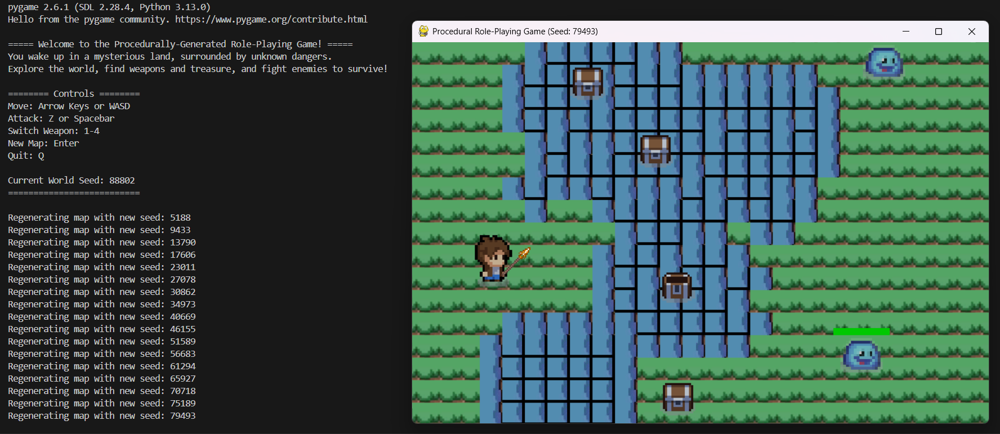
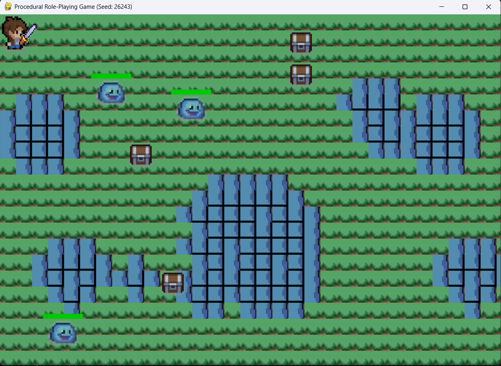
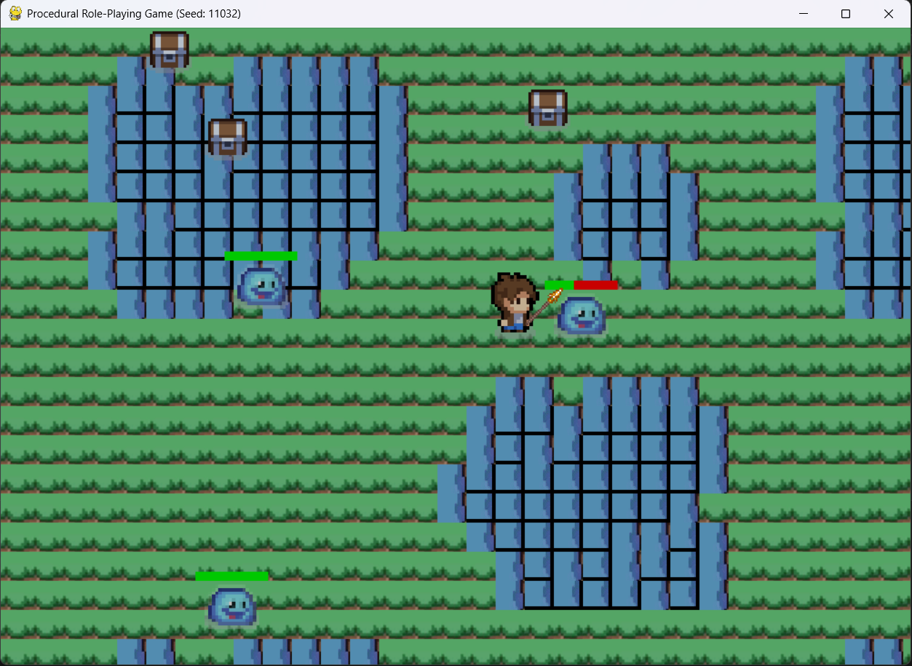
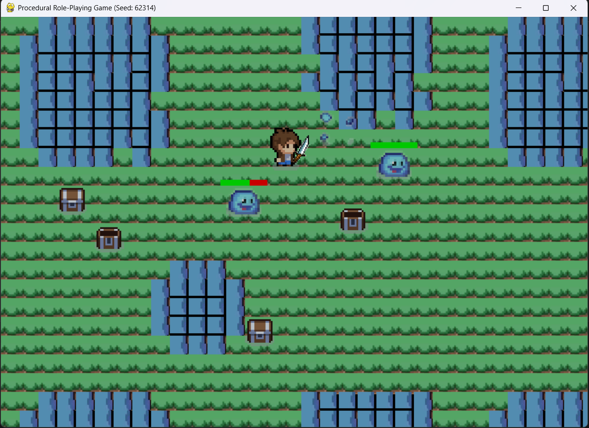

# Procedurally-Generated 2D Role-Playing Game (RPG)

## Overview

A 2D role-playing game (RPG) where players control a character navigating through procedurally-generated terrains filled with interactive objects and water bodies. The game features random encounters and real-time combat mechanics.

This game was developed as a team project using Python and Pygame as part of the [CIS 350 - Introduction to Software Engineering](https://www.gvsu.edu/catalog/course/cis-350.htm) course at [Grand Valley State University](https://www.gvsu.edu). It is designed for expansion with future updates and enhancements.

## Authors
- **Marcos Sanson**  
- **Jerod Muilenburg**  
- **William Krol**  
- **Brendon Do**  
- **Ely Miller**  

## Example Gameplay

### Here are some in-game screenshots:






## Features

### Current Release:
- **Character movement** using arrow keys or WASD
- **Collision detection** for water and objects
- **Procedurally-generated terrain** with diverse water formations
- **Random object generation** with collision mechanics
- **Dynamic enemies** with health bars and defeat animations
- **Weapon-based combat system** with cooldowns and multiple weapon types
- **Health bars** for enemies

### Planned Features:
- Character customization options
- Inventory management for items and weapons
- NPC dialogue system for immersive storytelling
- Day/night cycle affecting enemy behaviors
- Expanded enemy variety with unique AI
- Boss battles for challenging encounters

## Getting Started

### Prerequisites
- Python 3.7+
- Pygame 2.0+

### Installation
1. Clone the repository:
    ```sh
    git clone https://github.com/yourusername/Procedural-RPG.git
    ```
2. Install dependencies:
    ```sh
    pip install -r requirements.txt
    ```
3. Run the game:
    ```sh
    python main.py
    ```

### Controls
- **Move:** Arrow keys or WASD
- **Attack:** Space bar or Z
- **Switch Weapon:** 1-4
- **Regenerate Map:** Enter
- **Quit:** Q

## Development

This game was developed using Python and the Pygame library. It follows a waterfall development model, starting with prototyping and iterative development, progressing through testing, and finally delivering the finished product with regular updates.

### Key Technologies:
- **Python**: Primary language for game logic and mechanics
- **Pygame**: Library for rendering graphics, event management, and user input handling
- **Git**: Version control for project management and collaboration

### Project Structure
- `main.py` - Contains all game logic, including player movement, combat, terrain generation, and interactions
- `Testing/` - Contains unit tests for game mechanics
- `assets/` - Game assets (images)

## Contributing

1. **Fork** the repository
2. **Create a feature branch** (`git checkout -b feature/amazing-feature`)
3. **Commit your changes** (`git commit -m 'Add some amazing feature'`)
4. **Push to the branch** (`git push origin feature/amazing-feature`)
5. **Open a Pull Request**

## Acknowledgments
- Thanks to all team members who contributed to this project!
- Pygame community for their excellent documentation and support!
